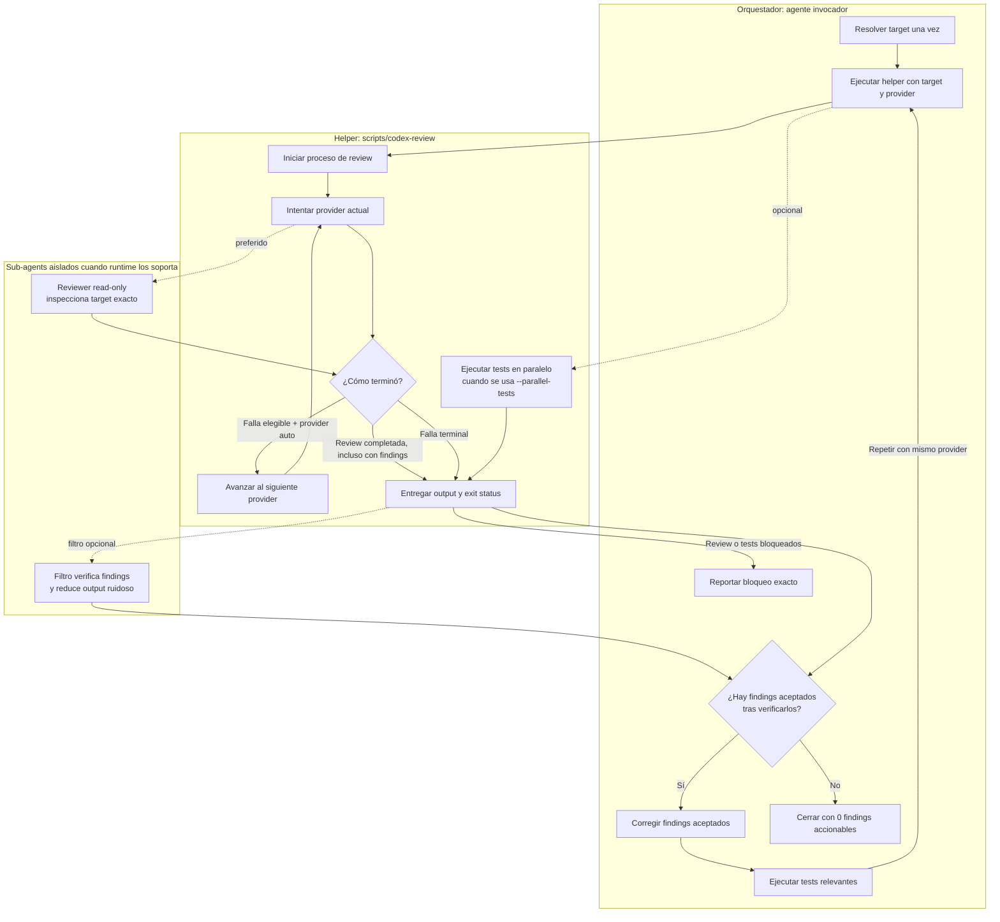

# Multi-Provider Code Review

Run a code review as a closeout check. Keep the `codex-review` name for compatibility, but select the first available provider in this order:

1. Claude Code
2. GitHub Copilot
3. Codex

This is code review, not Guardian `auto_review` approval routing.

Use when:
- user asks for Codex review, autoreview, or a second-model review
- after non-trivial code edits, before final/commit/ship
- reviewing a local branch or PR branch after fixes

## Contract

- Treat review output as advisory. Never blindly apply it.
- Verify every finding by reading the real code path and adjacent files.
- Read dependency docs/source/types when a finding depends on external behavior.
- Reject unrealistic edge cases, speculative risks, broad rewrites, and fixes that over-complicate the codebase.
- Prefer small fixes at the right ownership boundary; no refactor unless it clearly improves the bug class.
- Keep going until every launched review process exits and the completed review reports no accepted/actionable findings.
- When a provider reports accepted/actionable findings, enter the mandatory loop: review -> verify findings -> fix accepted/actionable findings -> run relevant tests -> rerun the same provider -> repeat until 0 accepted/actionable findings.
- Never stop after reporting findings with a passive closeout such as "No hice cambios; esto fue solo review." Fix accepted findings unless the user explicitly asks for review-only or forbids changes.
- If every finding is rejected after verification, document the rejection reason. Rerun only when code or review target changed.
- If a review-triggered fix changes code, rerun focused tests and review the updated target.
- Do not push just to review. Push only when the user requested push/ship/PR update.

## Arquitectura y bucle de feedback



Límites de responsabilidad:

- Agente orquestador controla verificación de findings, correcciones, tests relevantes y terminación del loop.
- Helper controla ejecución de target/provider, fallback elegible secuencial, tests paralelos opcionales y exit status de procesos.
- Sub-agents de reviewer y filtro son capacidades opcionales del runtime; procesos CLI de providers son adapters, no sub-agents nativos.
- Exit `0` del provider significa que review terminó. Solo output verificado con `0` findings aceptados o accionables significa loop limpio.

## Provider Selection

The bundled helper supports:

```bash
scripts/codex-review --provider auto
scripts/codex-review -p claude
scripts/codex-review -p copilot
scripts/codex-review -p codex
```

`auto` is the default and tries Claude Code, then GitHub Copilot, then Codex.

Do not ask which provider to use by default. A closeout check must remain non-interactive. If the user explicitly names a provider or passes `--provider/-p`, run only that provider and report a provider failure without fallback.

### Eligible fallback failures

Advance to the next provider only when the current provider could not perform the review because of:

- missing or non-executable provider binary
- authentication failure, expired credentials, or login required
- quota, rate limit, depleted credits, billing limit, or workspace `spend cap`
- infrastructure, network, timeout, TLS/DNS, overloaded, or service-unavailable errors

### Never fallback for

- a completed review with findings
- rejected or uncertain findings
- failed tests
- invalid review target or arguments
- malformed/unclassified provider output
- an unknown provider error
- a target that changed while review/tests were running

Fallback is recovery, not a second opinion. Never launch another provider after one completed a review.

After a provider completes, keep it for review reruns. If that provider later fails for an eligible reason, continue from the next provider in the order; do not restart from Claude.

### Provider diagnostics

Treat connector, model-selection, deprecation, or plugin warnings as diagnostics when provider completes a valid review. Do not trigger fallback from diagnostics alone. Include them briefly in final report only when they can affect review coverage or provider selection.

## Provider Adapters

### Claude Code

Prefer a read-only isolated subagent when the runtime supports one. Otherwise use Claude Code non-interactively:

```bash
claude --permission-mode plan \
  --tools Read,Grep,Glob,Bash \
  --no-session-persistence \
  --output-format text \
  -p "$REVIEW_PROMPT"
```

The prompt must identify the exact target, prohibit edits/commits/pushes, prohibit invoking `/codex-review` or any other review provider, and request direct findings only. This anti-recursion rule applies to subagents too.

### GitHub Copilot

Use prompt mode with plan/read-only behavior:

```bash
copilot --mode plan \
  --no-ask-user \
  --allow-all-tools \
  --deny-tool=write \
  --silent \
  -p "$REVIEW_PROMPT"
```

Do not grant write access. The prompt carries the same exact target and anti-recursion constraints used for Claude Code.

### Codex

Use Codex's built-in code review:

```bash
codex review --uncommitted
codex review --base origin/main
codex review --commit HEAD
```

Do not pass an inline prompt with `--base`; current CLI rejects `--base` plus `[PROMPT]` even though help text is ambiguous.

## Pick Target Once

Resolve one target before selecting a provider. Every fallback must review that same target; do not let each provider recalculate scope independently.

Dirty local work:

```bash
scripts/codex-review --mode local
```

Use local mode only when the patch is actually staged, unstaged, or untracked. A clean local review proves nothing about committed branch work.

Branch/PR work:

```bash
git fetch origin
base=$(gh pr view --json baseRefName --jq .baseRefName)
scripts/codex-review --mode branch --base "origin/$base"
```

Without an open PR, the helper uses `origin/main` for a non-main branch.

Committed single change with direct Codex:

```bash
codex review --commit HEAD
```

## Parallel Closeout

Format first if formatting can change line locations. Then tests and review may run in parallel:

```bash
scripts/codex-review --parallel-tests "<focused test command>"
```

The review side may perform sequential provider fallbacks while tests run once. Failed tests do not trigger provider fallback. If tests or review lead to edits, rerun affected tests and review the updated target.

When exact target already has relevant passing test evidence from current task and no files changed afterward, reuse that evidence instead of rerunning tests in parallel. Record command and result in final report.

## Context Efficiency

Provider output is usually noisy. Use isolated read-only filter only when runtime supports native subagents. Otherwise evaluate provider output directly. Ask filter to return only:

- actionable findings it accepts
- findings it rejects, with one-line reason
- exact files/tests to rerun

The filter must not invoke this skill or another provider. Run inline only for tiny changes or when subagents are unavailable.

## Long-Running Reviews

- Start exactly one provider attempt at a time.
- Wait for the selected command and every child process it launches to finish before fallback or closeout.
- Do not start the next provider while the previous process tree is alive.
- After 60 seconds without output, inspect provider process tree and publish concise heartbeat. Repeat every 60 seconds while active.
- Do not terminate a review only because it becomes quiet. At 10 minutes, inspect process tree again and report elapsed time; only helper/provider/host timeout counts as eligible fallback failure.
- Repeated plugin warnings, validation chatter, or lack of a final clean line are not success evidence.
- A run is clean only after all launched processes exit and verified review output contains 0 accepted/actionable findings.
- Never present a self-interrupted review as a clean or responsible partial closeout. If the environment terminates it, report the contract as unsatisfied.

## Helper

Installed helper:

```bash
~/.claude/skills/codex-review/scripts/codex-review --help
```

The helper:

- accepts `-p/--provider auto|claude|copilot|codex`
- chooses dirty local work first, otherwise PR/current branch
- uses the current PR base when available, otherwise `origin/main`
- supports binary overrides with `--claude-bin`, `--copilot-bin`, and `--codex-bin`
- supports `--output`, `--parallel-tests`, and `--dry-run`
- prints the provider that completed and every fallback cause
- treats unclassified provider failures as terminal instead of silently falling back

A successful provider process means the review completed, not automatically that it was clean. Verify its output before closeout.

## Final Report

Include:

- provider that completed the final review
- failed provider attempts and exact fallback reasons
- provider diagnostics that materially affected coverage, or `none`
- review command/surface and target used
- tests/proof run
- findings accepted/rejected, briefly why
- final clean result after all launched processes exited, or exact blocker

Do not run another provider solely to improve final wording, obtain a second opinion, or get a nicer clean line.
